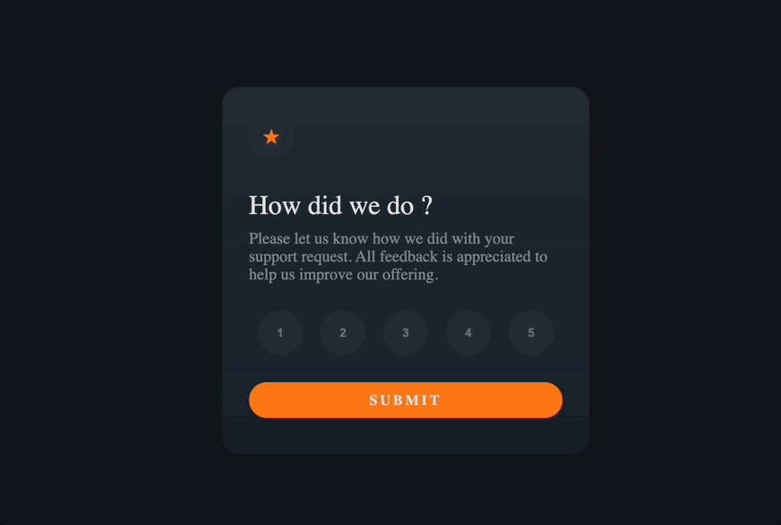

# Interactive rating component
This is a nice, small project to practice handling user interactions and updating the DOM.
This is implemented CSS, HTML and vanilla js.

# Challenge:
Your challenge is to build out this interactive rating component and get it looking as close to the design as possible.
You can use any tools you like to help you complete the challenge.
So if you've got something you'd like to practice, feel free to give it a go.

Your users should be able to:

Select and submit a number rating
See the "Thank you" card state after submitting a rating
See hover and focus states for all interactive elements on the page

You can find the detailed explanation of this challenge down below the link.
[Interactive Rating Component](https://www.frontendmentor.io/challenges/interactive-rating-component-koxpeBUmI)

# Demo:

## How to start

In the project directory, you can run:

### `yarn start`

Runs the app in the development mode.\
Open [http://localhost:3000](http://localhost:3000) to view it in the browser.

The page will reload if you make edits.\
You will also see any lint errors in the console.
